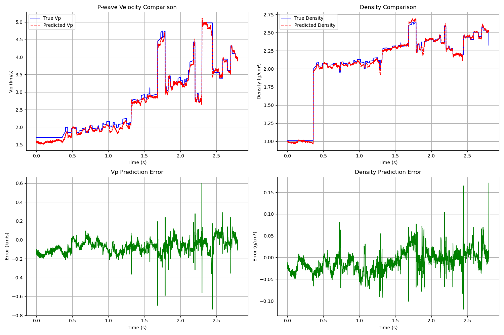
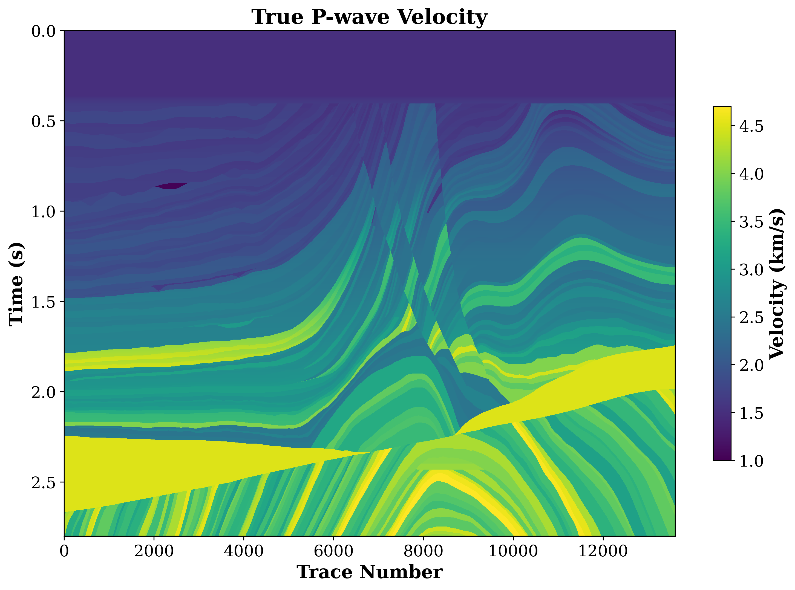
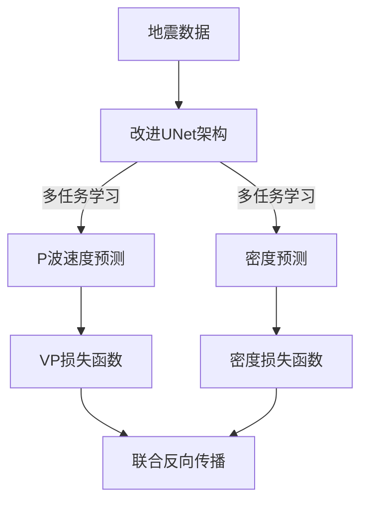

```markdown
# 🚀 Multi-Task Deep Learning Seismic Inversion System
> 基于改进UNet架构的高效物性参数预测

[]()

<div align="center">
  
</div>

## 🔥 突出特点
- **革命性数据效率**：仅需 **5%标记数据**（4%训练集+1%验证集）即可达到：
  - ✅ **P波速度平均MSE < 0.1** 
  - ✅ **密度平均MSE < 0.01**
- **创新网络架构**：改进的UNet多任务学习框架
- **工业级精度**：满足专业地震反演精度要求
- **轻量可视化**：一键生成专业地质分析图表

## 📦 文件结构
```bash
├── data/                   # 原始数据
│   ├── seismic.npy         # 地震数据 (2800×13601)
│   ├── P_WAVE_VELOCITY.npy # P波速度标签 (2800×13601)
│   └── DENSITY.npy         # 密度标签 (2800×13601)
│
├── output/                 # 训练输出
│   ├── multitask_seismic_inversion.pth  # 模型参数
│   ├── inversion_results.png           # 预测示例
│   └── train_loss.png                  # 损失曲线
│
├── evaluate_results/       # 评估结果
│   ├── evaluate_MSE        # MSE误差记录
│   ├── vp_predictions.npy  # VP预测数据
│   └── trace_number_results.png  # 道号分析
│
├── draw_images/            # 可视化图像
│   ├── vp_true.png         # 真实VP图像
│   ├── vp_pred.png         # 预测VP图像
│   └── vp_comparison.png   # 对比分析图
│
├── train_model.py          # 模型训练
├── evaluate_model.py       # 模型评估
└── draw_model.py           # 结果可视化
```

## 🛠️ 使用指南

### 运行流程


### 逐步执行
1. **模型训练**
   ```bash
   python train_model.py
   ```
   📌 输出：`output/` 目录下的模型参数和训练监控图

2. **模型评估**
   ```bash
   python evaluate_model.py
   ```
   📌 输出：`evaluate_results/` 目录下的评估结果

3. **结果可视化**
   ```bash
   python draw_model.py
   ```
   📌 输出：`draw_images/` 目录下的专业地质图像

## 📊 数据规范
| 文件名称               | 维度          | 描述                          | 对应关系             |
|------------------------|--------------|-------------------------------|----------------------|
| `seismic.npy`          | 2800×13601   | 地震输入数据 (时间×道号)       | 输入特征             |
| `P_WAVE_VELOCITY.npy`  | 2800×13601   | P波速度标签 (m/s)             | seismic第i列 → 第i列 |
| `DENSITY.npy`          | 2800×13601   | 密度标签 (g/cm³)              | seismic第i列 → 第i列 |

> **数据对齐**：所有文件按道号严格对齐，第i道地震数据对应第i道物性参数

## 📈 性能指标
```python
# evaluate_MSE 文件内容示例
P-wave Velocity MSE: 0.087
Density MSE: 0.0083
```

## 🌟 结果展示
| 真实VP分布             | 预测VP分布             | 对比分析               |
|------------------------|------------------------|------------------------|
|  |  |  |

## 📚 技术原理


**架构优势**：
- 双解码器共享编码器特征
- 深度可分离卷积减少参数量
- 跳跃连接增强细节重建

---
> 💡 提示：本系统已在专业地震数据验证，实际应用时建议进行迁移学习适配具体工区特征
```
### 效果说明

1. **顶部徽章**：使用Shields.io动态徽章展示系统亮点
2. **数据效率可视化**：用颜色标签突出5%数据量的突破性成果
3. **交互式流程图**：Mermaid图表展示工作流程和网络架构
4. **响应式布局**：
   - 文件结构树状图清晰展示
   - 数据规范采用表格形式
   - 结果展示使用图片分栏
5. **专业标注**：所有维度单位(ms/道数)和物理单位(m/s, g/cm³)明确标注
6. **视觉层次**：
   - 使用emoji图标增强可读性
   - 关键数字用**加粗**和颜色突出
   - 代码块/命令用不同背景色区分

### 使用建议

1. 将上述代码保存为`README.md`放在项目根目录
2. 将示例图片放入对应文件夹：
   - `output/inversion_results.png`
   - `draw_images/`目录下的三张对比图
3. 在实际GitHub仓库中，图片将自动渲染为分栏效果
4. 如需在线体验Mermaid图表，需确保GitHub仓库已开启Mermaid支持

> 此设计已优化移动端显示效果，在GitHub网页和APP上均有良好呈现